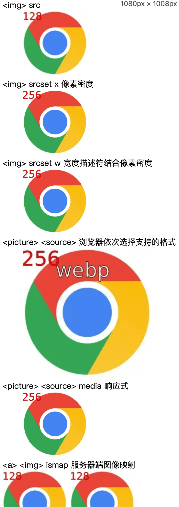
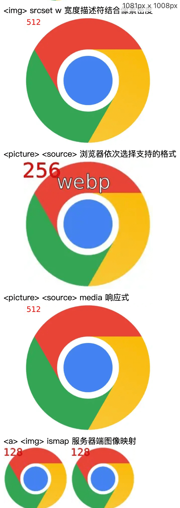
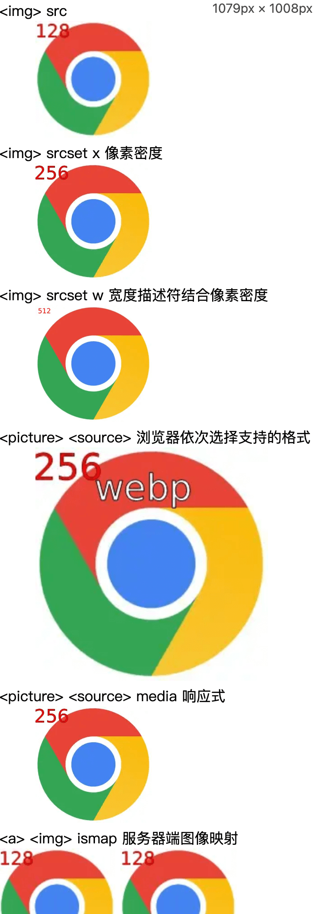
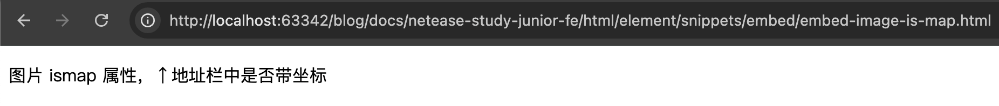
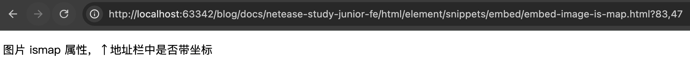
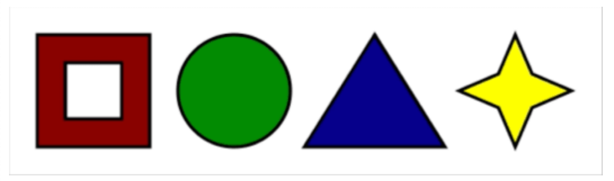
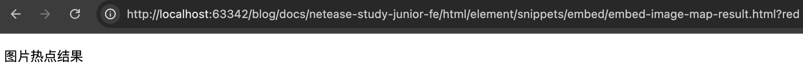
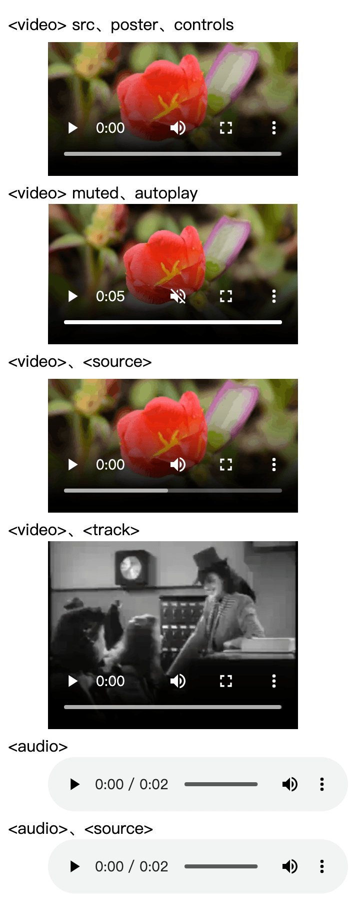
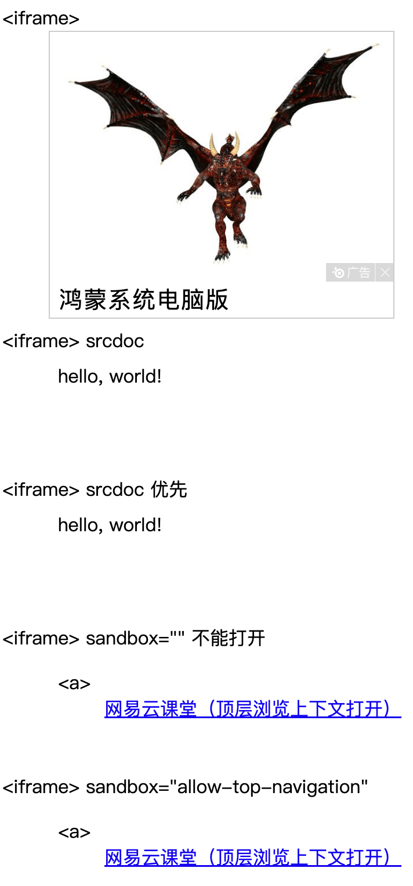

# 第十节 嵌入内容

---

<Badge type="tip" text="html" />

## 图片

* [📎 ``](https://developer.mozilla.org/zh-CN/docs/Web/HTML/Element/img)
  * 图像
  * 属性
    * `src` 资源地址
    * `alt` 图片无法显示时的替代文本
    * ~~`width`~~ 宽度
    * ~~`height`~~ 高度
    * `srcset`
      * 响应式图像
      * 宽度描述符，图片多少宽度显示结合像素密度（DPR）对应图片
        * ``
      * 像素密度，根据屏幕像素密度（DPR）显示对应图片
        * ``
    * `sizes` 资源尺寸 做响应式
    * `usemap` 客户端图像映射，对应 `<map name>`
    * `ismap`
      * 服务器端图像映射。点击图片的坐标被发送到服务器
      * 布尔属性
      * 是有效 `herf` 属性的 `<a>` 的后代元素才允许使用该属性
    * `referrerpolicy` referrer 信息发送策略
    * `crossorigin` 是否使用 cors
    * ~~`longdesc`~~ 详细描或 url
* [📎 `<picture>`](https://developer.mozilla.org/zh-CN/docs/Web/HTML/Element/picture)
  * `<source>`、`` 容器，不同场景显示不同图像
  ```html
  <picture>
    <!-- 浏览器从上往下选择能支持的格式显示 -->
    <source type="image/webp" srcset="/res/chrome.webp">
    <source type="image/png" srcset="/res/chrome256.png">
    <!-- <source> 不支持则显示  -->
    
  </picture>
  ```
* [📎 `<source>`](https://developer.mozilla.org/zh-CN/docs/Web/HTML/Element/source)
  * 媒体图像资源元素
  * 属性
    * `srcset` 响应式图像，同 ``
    * `type` 类型
    * `sizes` 资源尺寸 做响应式
    * `media` 媒体查询
  ```html
  <picture>
    <!-- 小于等于 1080 显示第1个 source，若是 retina 屏显示 chrome256.png 否则显示 chrome128 -->
    <source srcset="/res/chrome128.png 1x, /res/chrome256.png 2x" media="(max-width: 1080px)">
    <!-- 大于 1080 显示第2个 source，若是 retina 屏显示 chrome512.png 否则显示 chrome256 -->
    <source srcset="/res/chrome256.png 1x, /res/chrome512.png 2x">
    
  </picture>
  ```

::: code-group
```js :no-line-numbers [index.js]
/**
 * 图片
 */
```

<<< ./snippets/embed/embed-image.html
<<< ./snippets/embed/embed-image-is-map.html
:::







## 图片热点

* [📎 `<map>`](https://developer.mozilla.org/zh-CN/docs/Web/HTML/Reference/Elements/map)
  * 图像映射
  * 属性
    * `name` 名称
* [📎 `<area>`](https://developer.mozilla.org/zh-CN/docs/Web/HTML/Reference/Elements/area)
  * 图像映射区域
  * 属性
    * `alt` 图片无法显示时的替代文本
    * `href` 超链接目标
    * `shape` 形状
      * `rect` 矩形
      * `circle` 圆形
      * `poly` 多边形
      * `default` 除已定义形状区域外的整个区域
    * `coords` 区域大小、位置
      * `shape="rect"` 值为 `x1,y1,x2,y2`
      * `shape="circle"` 值为 `x,y,radius`
      * `shape="poly"` 值为 `x1,y1,x2,y2,..,xn,yn`
    * `download` 下载，同 `<a download>`
    * `hreflang` 语言
    * `rel` 当前文档与被链接文档的关系
    * `target`
      * 在何处显示
      * `_self` 当前页面打开
      * `_blank` 新标签页打开
      * `_parent` 父级浏览环境打开
      * `_top` 顶级浏览环境打开
    * `type` 类型
    * `referrerpolicy` referrer 信息发送策略

::: code-group
```js :no-line-numbers [index.js]
/**
 * 图片热点
 */
```

<<< ./snippets/embed/embed-image-map.html
<<< ./snippets/embed/embed-image-map-result.html
:::




## 音频视频

* [📎 `<video>`](https://developer.mozilla.org/zh-CN/docs/Web/HTML/Element/video)
  * 视频、带字幕音频
  * 属性
    * `src` 资源地址
    * ~~`width`~~ 宽度
    * ~~`height`~~ 高度
    * `poster` 海报地址
    * `preload` 预加载
      * `none` 不预加载
      * `metadata` 仅预先获取视频元数据
      * `auto` 下载整个视频文件
      * 空字符串 同 `auto`
    * `autoplay`
      * 自动播放
      * 布尔属性
      * [📎 自动播放指南](https://developer.mozilla.org/zh-CN/docs/Web/Media/Guides/Autoplay)
    * `loop` 重复播放 布尔属性
    * `muted` 静音 布尔属性
    * `controls` 显示控制面板 布尔属性
    * `crossorigin` 是否使用 cors
* [📎 `<source>`](https://developer.mozilla.org/zh-CN/docs/Web/HTML/Element/source)
  * 媒体视频资源元素
  * 属性
    * `src` 资源地址
    * `type` 类型
* [📎 `<track>`](https://developer.mozilla.org/zh-CN/docs/Web/HTML/Reference/Elements/track)
  * 文本轨元素、字幕
  * 属性
    * `kind`
      * `subtitles` 语言翻译
      * `captions` 非语言信息
      * `description` 描述
      * `chapters` 章节
      * `metadata` 脚本元素使用，用户不可见
    * `src` 资源地址
    * `srclang` 字幕语言
    * `label` 显示字幕标签
    * `deafult` 默认字幕
* [📎 `<audio>`](https://developer.mozilla.org/zh-CN/docs/Web/HTML/Reference/Elements/audio)
  * 音频
  * 属性
    * `src` 资源地址
    * `preload` 预加载
      * `none` 不预加载
      * `metadata` 仅预先获取视频元数据
      * `auto` 下载整个视频文件
      * 空字符串 同 `auto`
    * `autoplay`
      * 自动播放
      * 布尔属性
      * [📎 自动播放指南](https://developer.mozilla.org/zh-CN/docs/Web/Media/Guides/Autoplay)
    * `loop` 重复播放 布尔属性
    * `muted` 静音 布尔属性
    * `controls` 显示控制面板 布尔属性
    * `crossorigin` 是否使用 cors

::: code-group
```js :no-line-numbers [index.js]
/**
 * 视频
 */
```

<<< ./snippets/embed/embed-video-audio.html
:::



## iframe

* [📎 `<iframe>`](https://developer.mozilla.org/zh-CN/docs/Web/HTML/Reference/Elements/iframe)
  * 内嵌[📎 浏览上下文](https://developer.mozilla.org/zh-CN/docs/Glossary/Browsing_context)
  * 另一个 HTML 页面嵌入当前页面中
  * 属性
    * `name` 浏览上下文名称
    * `src` HTML 页面地址
    * `srcdoc` 内联 HTML
    * ~~`width`~~ 宽度
    * ~~`height`~~ 高度
    * `sandbox` 控制内容的限制
      * 空值应用所有限制
      * 空格分隔解除特定限制
      * `allows-downloads` 允许下载文件
      * `allows-forms` 允许校验、提交表单
      * `allows-modals` 允许打开模态窗
      * `allows-orientation-lock` 允许[📎 锁定屏幕方向](https://developer.mozilla.org/zh-CN/docs/Web/API/Screen/lockOrientation)
      * `allows-pointer-lock` 允许使用[📎 指针锁定 API](https://developer.mozilla.org/zh-CN/docs/Web/API/Pointer_Lock_API)
      * `allows-popups` 允许弹窗
      * `allows-popups-to-escape-sandbox` 允许打开新的浏览上下文不继承沙箱标记
      * `allows-presentation` 允许开启演示[📎 会话](https://developer.mozilla.org/en-US/docs/Web/API/PresentationRequest)
      * `allows-same-origin` 没有时使同源策略失效阻止数据存储等 API 访问
      * `allows-scripts` 允许运行脚本
      * `allows-storage-access-by-user-activation` 允许访问非分区 cookie
      * `allows-top-navigation` 允许导航顶级（_top）浏览上下文
      * `allows-top-navigation-by-user-activation` 允许导航顶级浏览上下文，只能由用户手势启动
      * `allows-top-navigation-to-custom-protocols` 允许导航到非 http 协议页面
    * `allowfullscreen` 允许[📎 全屏模式](https://developer.mozilla.org/zh-CN/docs/Web/API/Element/requestFullscreen)
    * `allowpaymentrequest` 允许调用[📎 支付请求 API](https://developer.mozilla.org/zh-CN/docs/Web/API/Payment_Request_API)
    * `referrerpolicy` referrer 信息发送策略

::: code-group
```js :no-line-numbers [index.js]
/**
 * iframe
 */
```

<<< ./snippets/embed/embed-iframe.html
<<< ./snippets/embed/embed-iframe-a.html
:::



## 课后练习

::: code-group
```js :no-line-numbers [index.js]
/**
 * 课后练习 图片
 */
```

<<< ./snippets/embed/embed-image-2.html
:::
