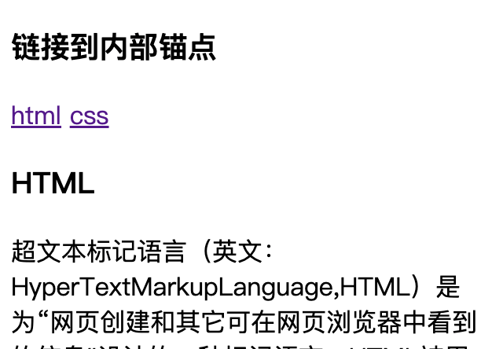
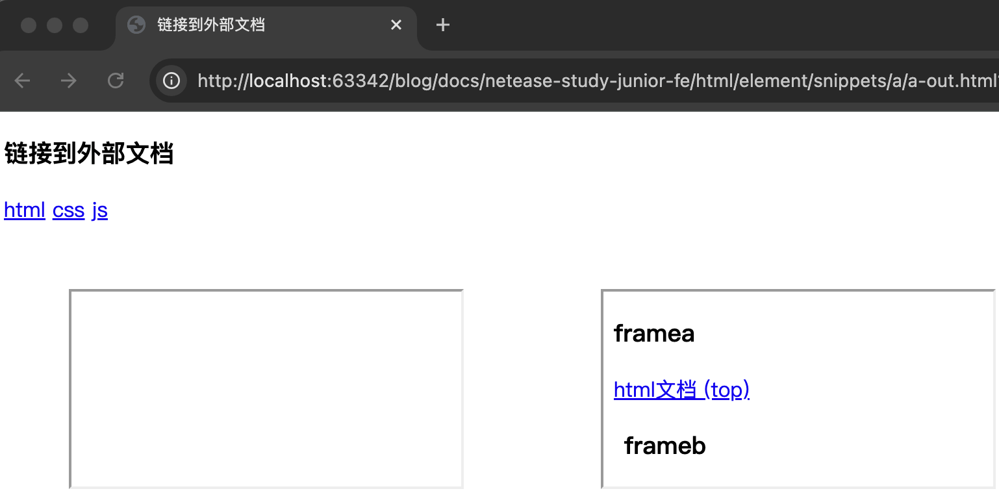

# 第七节 超链接

---

<Badge type="tip" text="html" />

## [📎 `<a>`](https://developer.mozilla.org/zh-CN/docs/Web/HTML/Element/a)

### 内容类型

* 另一个文档
* 文档内部锚点
* Email 地址
* 电话号码

### 属性

* `href`
  * 资源地址
  * 锚点
  ```html
  <ul>
    ...
    <li><a href="#buy">抢购商品</a></li>
    <li><a href="#pay">下单支付</a></li>
    ...
  </ul>
  <div>
    ...
    <div id="buy">2.抢购商品...</div>
    <div id="pay">3.下单支付...</div>
    ...
  </div>
  <li><a href="#">top</a></li>
  ```
  ::: code-group
  ```js :no-line-numbers [index.js]
  /**
   * <a> href 文档内部锚点
   */
  ```

  <<< ./snippets/a/a-inner.html
  :::

  

  * Email 地址
    * `<a href="mailto:yixinplus@188.com">联系我们</a>`
    * `<a href="mailto:yixinplus@188.com?cc=admin@188.com&subject=建议&body=body...">联系我们</a>`
  * 电话号码
    * `<a href="tel:13612345678">13612345678</a>`
* `target`
  * 在何处显示
  * `self` 当前页面打开
  * `_blank` 新标签页打开
  * `_parent` 父级浏览环境打开
  * `top` 顶级浏览环境打开
  * 浏览环境名称
  ::: code-group
  ```js :no-line-numbers [index.js]
  /**
   * <a> target 属性
   */
  ```
  
  <<< ./snippets/a/a-out.html
  <<< ./snippets/a/site/html.html [site/html.html]
  <<< ./snippets/a/site/css.html [site/css.html]
  <<< ./snippets/a/site/js.html [site/js.html]
  <<< ./snippets/a/site/framea.html [site/framea.html]
  <<< ./snippets/a/site/frameb.html [site/frameb.html]
  :::

  

* `download`
  * 下载
  * 值是下载文件的建议名称，同域名下可以重命名，跨域时不能重命名
  * `<a href="https://code.visualstudio.com/shortcuts/keyboard-shortcuts-macos.pdf" download="VsCode.pdf">vsCode快捷键（跨域重命名)</a>`
* `hreflang` 语言
* `rel` 当前文档与被链接文档的关系
* `rev` 被链接文档与当前文档的关系
* `type` 类型
* `referrerpolicy` referrer 信息发送策略

## 课后练习

::: code-group
```js :no-line-numbers [index.js]
/**
 * 课后练习 超链接
 */
```

<<< ./snippets/a/test.html
:::