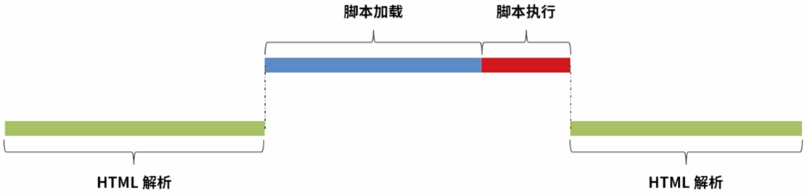
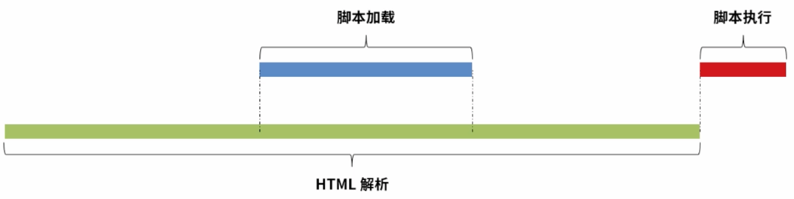
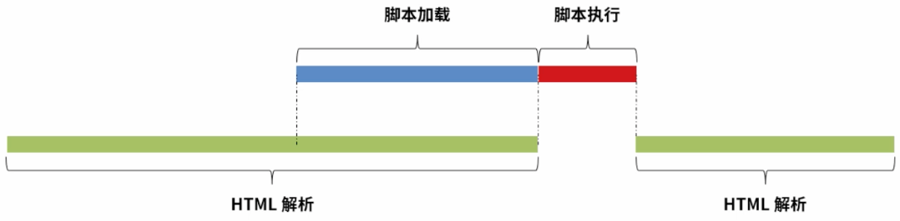
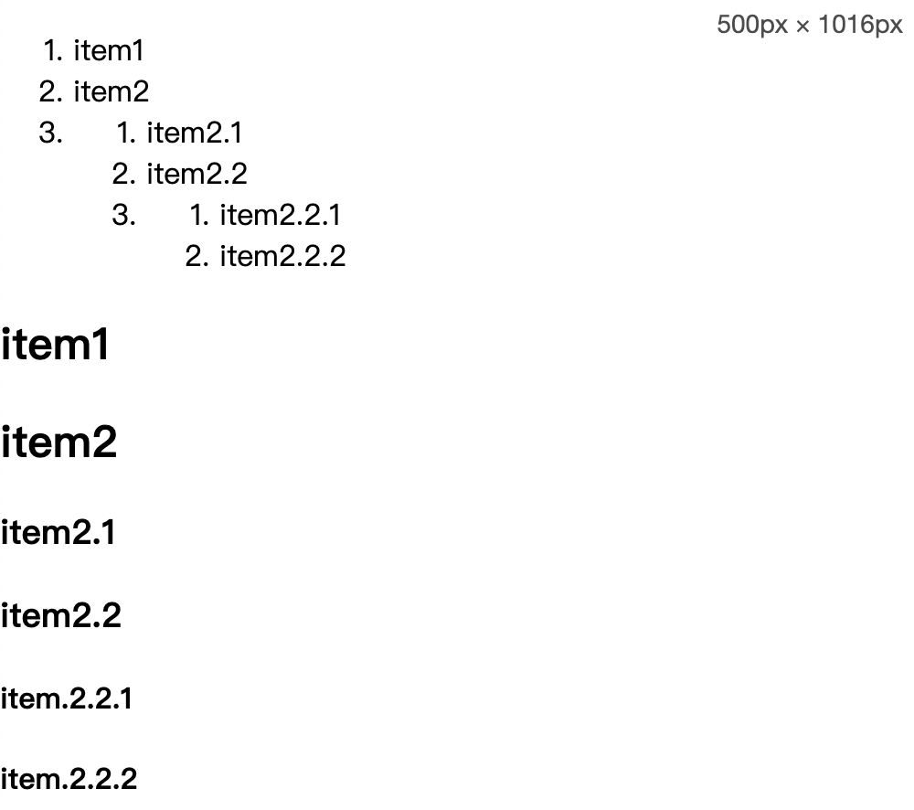
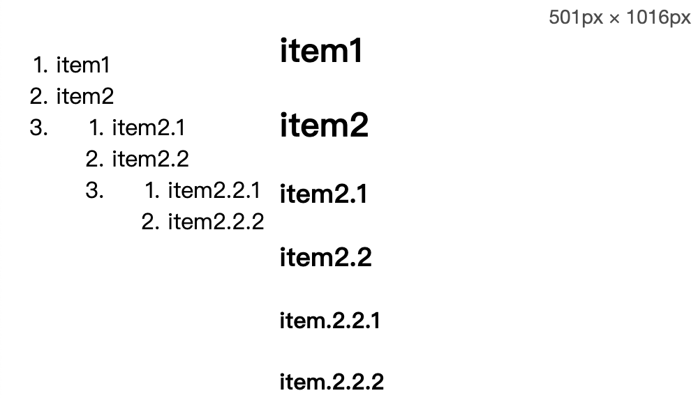

# 第五节 插入脚本

---

<Badge type="tip" text="html" />

## 作用

* 实现交互能力

## 插入方式

### 行内脚本 (Inline Script)

* `on[EventName]` 事件触发
  * 如：`<input type="button" value= "Hello" onclick="window.alert('Hello World !')">`
* javascript 伪协议
  * 如：`<a href="javascript:alert('Hello World !"); return false;">Hello</a>`

### 内嵌脚本 (Internal Script)

* [📎 `<script>`](https://developer.mozilla.org/zh-CN/docs/Web/HTML/Element/script)
  * 如：
    ```javascript
    <script>
      document.write('<p>Hello World !</p>');
    </script>
    ```

### 外联脚本 (External Script)

* `<script>`

::: code-group
```js [index.js]
document.write('<p>Hello World !</p>');
```
```html [index.html]
<script src="index.js"></script>
```
:::

## 内嵌脚本

```html
<script type="text/javascript">
  document.write('<p>Hello World !</p>');
</script>
```

* `<script type>`
  * 默认`text/javascript`
  * JavaScript 脚本类型
    * `application/ecmascript`, `application/javascript`, `application/x-ecmascript`, `application/x-javascript`
    * `text/ecmascript`, `text/javascript`, `text/javascript1.0`, `text/javascript1.1`, `text/javascript1.2`, `text/javascript1.3`, `text/javascript1.4`, `text/javascript1.5`, `text/script`, `text/livescript`, `text/x-ecmascript`, `text/x-javascript`
  * JavaScript 脚本类型建议不写
  * ❗内嵌脚本时要注意
    * 浏览器编译会将 `<script>` 最近的闭合标签 `</script>` 中间的内容作为脚本解析。脚本内容中有 `</script>` 则会出现问题。
    * `'</sc' + 'ript>'` 打散
    * `&lt;/script>` 用实体字符代替
  * `module`
    * ES6 引入模块化
    ```js
    // api.js
    export function test() { console.log('test'); }
    export function greet(msg) { console.log(msg); }
    ```
    ```html
    <!-- index.html -->
    <script type="module">
      import { test, greet } from "/api.js";
      greet('Hello World !');
      test();
    </script>
    ```
  * `type` 设置成 javascript 叫 Classic Script 传统脚本
  * 设置成 `module` 叫 Module Script 模块化脚本
* `<scirpt>` 标签间的内容块
  * 不一定用作脚本
  * 可以用作数据块，浏览器不会作为脚本进行解析
  * 如：
  ```html
  <script type="text/×-handlebars-template">
    <div class="entry">
      <h1>{{title}}</h1>
      <div class="body">{{body}}</div>
    </div>
  </script>
  ```

## 外联脚本

* 传统脚本 `<script src="app.js" type="text/javascript" charset="utf-8" crossorigin="anonymous'" async defer></script>`
* 模块化脚本 `<script src="app.js" type="module" crossorigin="anonymous" async></script>`
* `src` 资源地址
* `type` 脚本类型
* `chartset` 编码方式
* [📎 `crossorigin`](https://developer.mozilla.org/zh-CN/docs/Web/HTML/Attributes/crossorigin) 跨域脚本处理
* `async` `defer`
  * 脚本执行方式
  * 布尔属性
  * 并行加载脚本
  * `async` 立即执行
  * `defer` HTML 解析完成后执行
  * `async` `defer` 同时设置，优先执行 `async`
  * `<script>`
    
  * `<script defer>`
    
  * `<script async>`
    
  * `crossorigin`
    * 传统脚本
      * 是否走 CORS 流程
      * 是否暴露异常的详细信息
      * 控制脚本请求时是否携带用户授信信息，如cookie等
    * 模块化脚本
      * 控制脚本请求时是否携带用户授信信息，如cookie等
      * 是跨域时必须走走 CORS 流程
    * `anonymous`
      * 不带 cookie
      * `<script src="http://a.b.com/app.js" crossorigin></script>`
      * `<script src= "http://a.b.com/app.js" crossorigin=""></script>`
      * `<script src="http://a.b.com/app.js" crossorigin="anonymous"></script>`
    * `use-credentials`
      * 带 cookie
      * `<script src="http://a.b.com/app.js" crossorigin="use-credentials"></script>`

## 课后练习

::: code-group
```js :no-line-numbers [index.js]
/**
 * 课后练习 脚本控制响应式布局
 */
```

<<< ./snippets/media/media.html
<<< ./snippets/media/style.css
<<< ./snippets/media/script.js
:::


