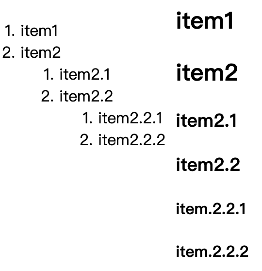

# 第四节 插入样式

---

<Badge type="tip" text="html" />

## 作用

* 装饰
* 终点强调
* 表现能力

## 插入方式

### 行内样式 (Inline Style)

* `style` 属性
  ```html
  <p style="font-size: 14px; text-align: left">这是一个段落</p>
  ```
* 冗余代码，无法复用
* 无法实现鼠标移入、hover 效果

### 内嵌样式表 (Internal Style Sheet)

* `<style>` 元素
  ```html
  <style>
    p{font-size: 14px; text-align: left}
  </style>
  <p>这是一个段落</p>
  ```
* 无法跨文档复用

### 外联样式表 (External Style Sheet)

* `<link>`
  ::: code-group
  ```css [style.css]
  p{font-size: 14px; text-align: left}
  ```
  ``` html [index.html]
  <link rel="stylesheet" href="style.css">
  ```
  :::

## 外联样式表

### [📎`<link>`](https://developer.mozilla.org/zh-CN/docs/Web/HTML/Element/link)

* 定义当前文档与外部资源的关系
* 如：`<link rel="stylesheet" type="text/css" href="style.css" media="all">`
* 作用
  * 超链接
    * 如：`<link href="chapter1.html" rel="prev" rev="next">`
    * `<link href="chapter3.html" rel="next" rev="prev">`
  * 外联资源
    * 如：`<link rel="icon" href="favicon png" sizes="16x16" type="image/png">`
    * `<link rel="stylesheet" href="style.css">`
* `rel`
  * relationship 当前文档与资源的关系
  * 必须有
  * [📎 `rel` 值](https://developer.mozilla.org/zh-CN/docs/Web/HTML/Attributes/rel)
  * 多个值用空格分隔
* `href`
  * hypertext reference 资源地址
  * 必须有
  * 值是 URL 地址
* `type`
  * 资源的 [📎 MIME](https://developer.mozilla.org/zh-CN/docs/Web/HTTP/Basics_of_HTTP/MIME_types) 属性
  * 可选属性
  * 浏览器判断不支持则不加载
* `media`
  * 对资源有效的媒体设备
  * 实现响应式
    * 如 `<link rel="stylesheet" href="ver.css" media="(max-width: 500px)">` 屏幕宽度小徐500px时生效

## 课后练习

::: code-group
```js :no-line-numbers [index.js]
/**
 * 课后练习 <link media>
 */
```

<<< ./snippets/media/media.html
<<< ./snippets/media/horizontal.css
<<< ./snippets/media/print.css
:::


