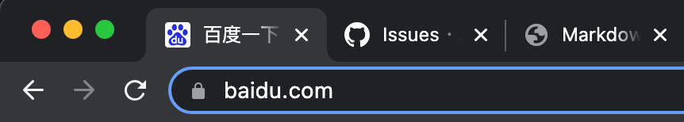
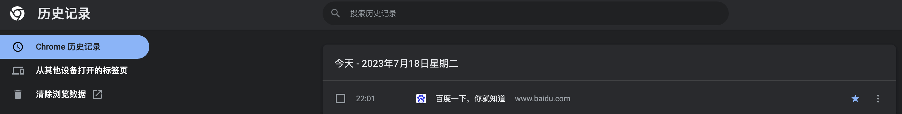
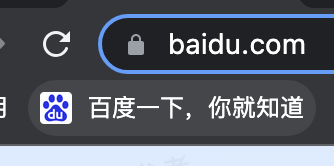
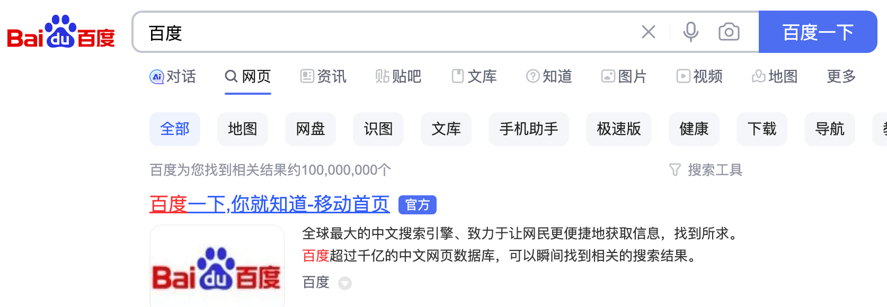
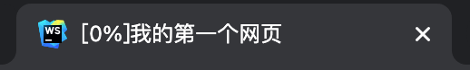
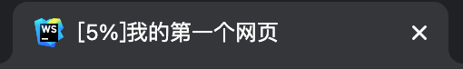
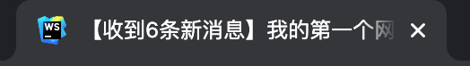
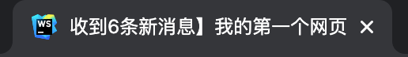

# 第二节 文档标题

---

<Badge type="tip" text="html" />

## 应用

* 标签栏
  
* 历史记录
  
* 浏览器书签
  
  * 名称默认是页面的标题
* 搜索引擎结果
  
  

## 文档标题

* `<title>`
* 建议一个文档指定一个标题
* 元素内容当文本处理
* `document.title`
  * 通过脚本获取、设置

## 实例

### 进度

::: code-group
```js :no-line-numbers [index.js]
/**
 * 文档标题进度实例
 */
```

<<< ./snippets/title-progress.html {11,14}
:::




### 消息

* 滚动效果

::: code-group
```js :no-line-numbers [index.js]
/**
 * 文档标题消息实例
 */
```

<<< ./snippets/title-notice.html {12,15}
:::


