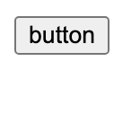

# 第二章 HTML 语法

---

<Badge type="tip" text="html" />

## HTML 语法

::: code-group
```js :no-line-numbers [index.js]
/**
 * HTML 语法实例
 */
```
``` html [index.html]
<!DOCTYPE html>
<html>
<head>
  <title>HTML 语法结构</title>
</head>
<body>
  <h1>HTML 语法结构</h1>
  <p>这是一个<a href="demo.html">简单的</a>案例</p>
  <!-- 这是注释 -->
</body>
</html>
```
:::

### 结构

* 开始标签 + 元素内容 + 结束标签
* **大部分**HTML 元素有开始标签、结束标签
  * 开始标签、结束标签在一对尖括号 `<>` 中间
  * 结束标签在标签名前加斜杠 `/`
* 标签名大小写都可以，一般建议**小写**
* 元素内容
  * 可以是文本
  * 可以是嵌套其他元素
* 没有结束标签的元素，如 `<base>` `<link>` `<param>` `<hr>` `<br>` `<wbr>` `<input>` `<area>` `` `<col>` `<embed>` `<source>` `<track>`

### 属性

```html
<a href="demo.html">案例</a>
<a href="demo=css.html">案例</a>
```

* 属性名 `=` 属性值
* 控制元素行为
* 属性名大小写不敏感
* 属性值一般用 `"` 包括
  * 若值中有 `空格` `'` `"` <code>\`</code> `=` `<` `>` 必须用引号包括

#### [🔗 布尔属性](https://developer.mozilla.org/zh-CN/docs/Web/HTML/Attributes#%E5%B8%83%E5%B0%94%E5%B1%9E%E6%80%A7)

```html
<button disabled>按钮</button>
```

* 省略形式，有表示 `true`，没有表示 `false`
* 属性值只有和属性名一致表示 `true`
* 如 `disabled` `readonly` `required` `checked` `selected`

### 嵌套

```html
<p>这是一个<a href="demo.html">简单的</a>案例</p>
```

* 注意结束标签顺序

### 注释

```html
<!-- 这是注释 -->
```

* <code>\<!--</code> + 注释内容 + <code>--\></code>
* 浏览器不渲染，用户不可见
* 用于描述代码

## [🔗 全局属性](https://developer.mozilla.org/zh-CN/docs/Web/HTML/Global_attributes)

* 对所有元素有效
* `id` 唯一标识符
* `class` 类名
* `style` 行内样式
  * 不建议使用，不容易维护
* `title` 相关信息文本
  * 鼠标移动上去会显示信息
* `accesskey` `contenteditable` `dir` `draggable` `hidden` `lang` `spellcheck` `tabindex` `translate`

## [🔗 实体字符](https://developer.mozilla.org/zh-CN/docs/Glossary/Entity)

* `&` + 实体名称 + `;`
* `&#` + 实体编号 + `;`
  * 实体名称大小写敏感
* 用于表示保留字符(会被解析为 HTML 代码)和不可见字符(如空格)
* 常用实体
  * `&nbsp;` `&#160;` 空格
  * `&quot;` `&#34;` "
  * `&gt;` `&#62;` >
  * `&lt;` `&#60;` <
  * `&copy;` `&#169;` ©
  * `&amp;` `&#38;` &

## 课后练习

::: code-group
```js :no-line-numbers [index.js]
/**
 * 课后练习
 */
```
``` html [index.html]
<!DOCTYPE html>
<html>
<head>
  <meta http-equiv="Content-Type" content="text/html; charset=utf-8">
  <title>HTML 语法</title>
</head>
<body>
  <button>button</button>
  <p>这是注释</p> // [!code --]
  <!-- <p>这是注释</p> --> // [!code ++]
</body>
</html>
```
:::


