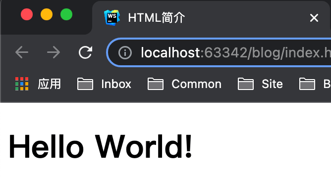

# 第一章 HTML 简介

---

<Badge type="tip" text="html" />

## 基本概念

* HyperText Markup Language 超文本标记语言
* 超文本是包含超链接的文档
* 作用是标记内容

## 发展史

* **1991 HTML**
  * [📎 蒂姆·伯纳斯-李](https://zh.wikipedia.org/wiki/%E8%92%82%E5%A7%86%C2%B7%E4%BC%AF%E7%BA%B3%E6%96%AF-%E6%9D%8E)写了 HTML Tags 文档，描述了18个元素
* **1995 HTML 2.0**
  * IETF
  * 之后由 万维网联盟(W3C) 维护
* **1999 HTML 4.01**
  * W3C 认为 HTML 语法松散，推出语法严格的 XHTML
  * 浏览器厂商不认同，成立 网页超文本应用技术工作小组(WHATWG)
* **2014 HTML 5**
  * WHATWG W3C合作开发
* **最新版本 2017 HTML 5.2**

## 文档结构

::: code-group
```js :no-line-numbers [index.js]
/**
 * 文档结构
 */
```
``` html [index.html]
<!DOCTYPE html> <!-- 文档声明 -->
<html> <!-- 根元素 -->
<head> <!-- 文档头部 -->
  <meta charset="utf-8">
  <title>网易云音乐 听见好时光</title>
  <meta name="keywords" content="音乐...">
  <meta name="description" content="网易...">
  <meta name="viewport" content="width=device-width">
  <link rel="shortcut icon" href="favicon.ico">
  <link rel="stylesheet" href="../css/style.css">
  <style>p{color:#999;}</style>
</head>
<body> <!-- 文档主体 -->
  <div class="g-topbar"›...</div>
  <iframe>...</iframe>
  <div class="g-btmbar">...</div>
</body>
</html>
```
:::

### 文档声明

* 告诉浏览器文档解析标准
  * 否则可能用兼容模式等非标准的 HTML 模式
* 第一行顶格
* `<!DOCTYPE 声明内容>`
* 大小写不敏感
* HTML5 是 `<!DOCTYPE html>`
  * HTML4.01
    * `strict.dtd`
    * `loose.dtd`
    * `frameset.dtd`

### 文档头部

* 包含文档元数据
* 描述文档属性、信息
* `<meta>` `<title>` `<link>` `<style>`
* 只有 `<title>` `favicon` 作为内容进行展示

### 文档主题

* 用户在页面真正能看到的内容

## 课后练习

::: code-group
```js :no-line-numbers [index.js]
/**
 * 课后练习
 */
```
``` html [index.html]
<!DOCTYPE html>
<html>
<head>
  <meta http-equiv="Content-Type" content="text/html; charset=utf-8">
  <title>HTML 简介</title>
</head>
<body>
  <h1>Hello World!</h1>
</body>
</html>
```
:::

