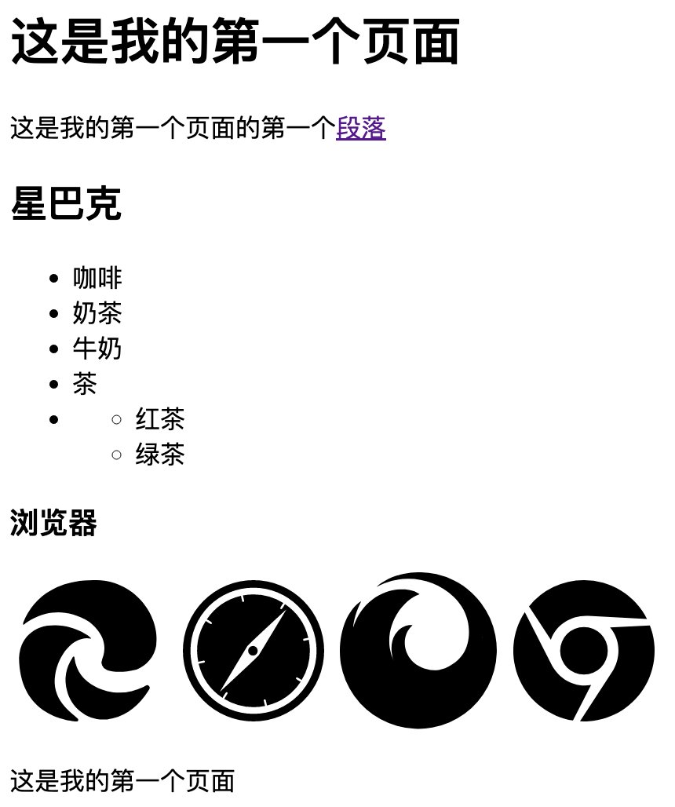
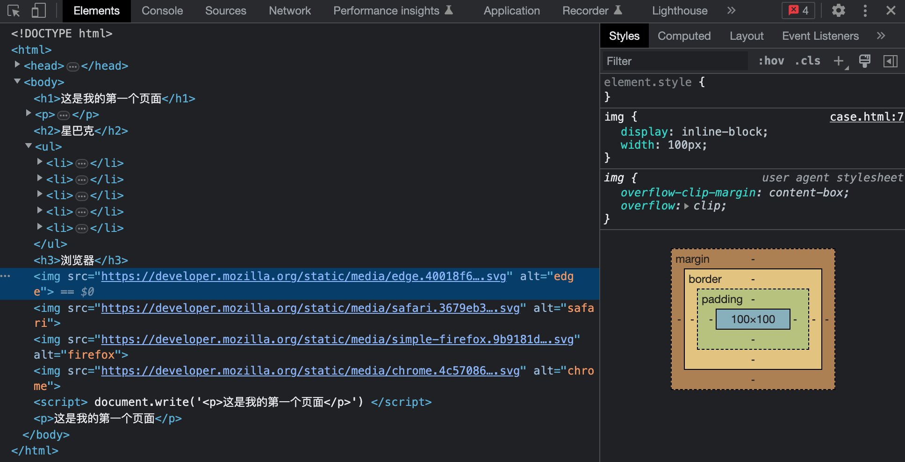
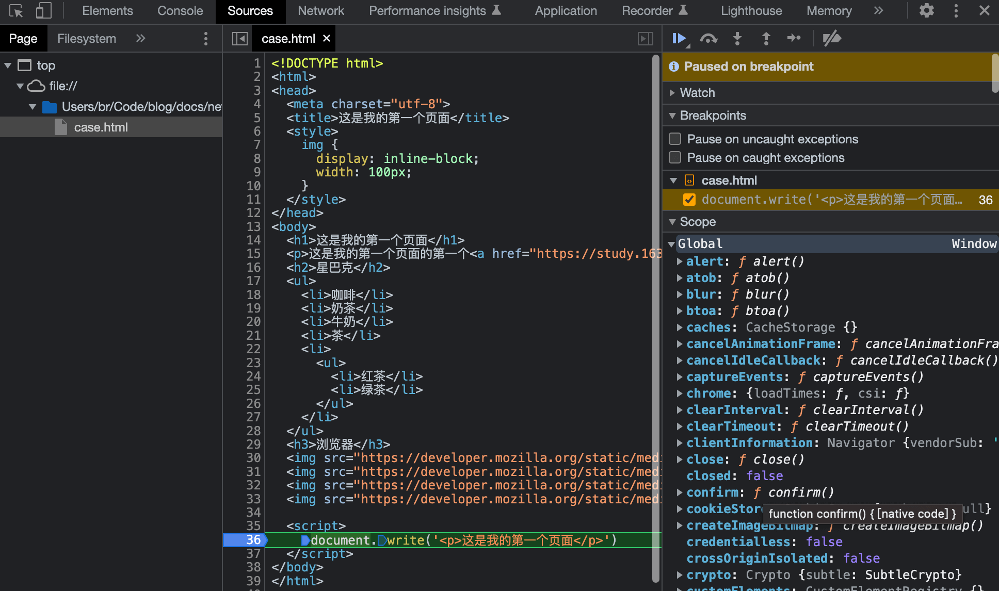

# 第三章 前端入门案例

---

<Badge type="tip" text="前端" />

## 开发环境

### 浏览器

* Internet Explore 💔
* Apple Safari
* Mozilla Firefox
* Google Chrome ❤️

### 文本编辑器

* NotePad
* NotePad++
* Sublime Text

## 页面基本结构

::: code-group
<<< ./snippets/case.html
:::

## 开发者工具

* Chrome 开发者工具打开方式
  * `command` + `option` + `I` `F12` `Ctrl` + `Shift` + `I`
  * 设置 > 更多工具 > 开发者工具
* Elements
  * 
  * 查看 DOM 树结构，修改样式、类。查看盒模型、样式计算结果、DOM属性
* Sources
  * 
  * 查看脚本，打断点调试，查看对应作用域的变量、调用栈

## IDE

* WebStorm
* VSCode
* 基础功能
  * 高亮
  * 自动补全
  * 显示语法错误
  * 显示颜色
  * Web 服务器
