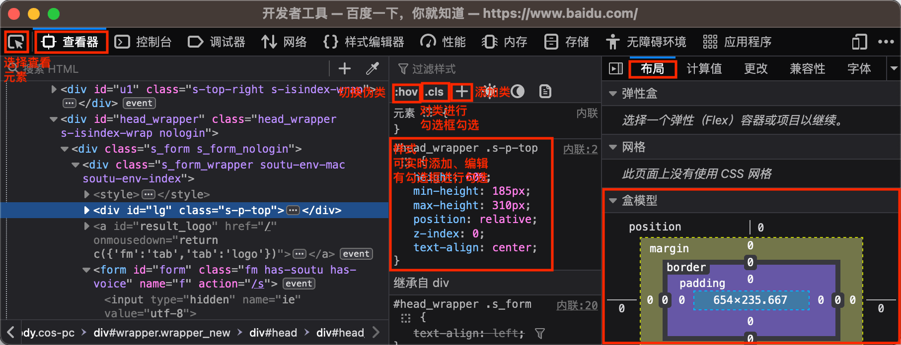
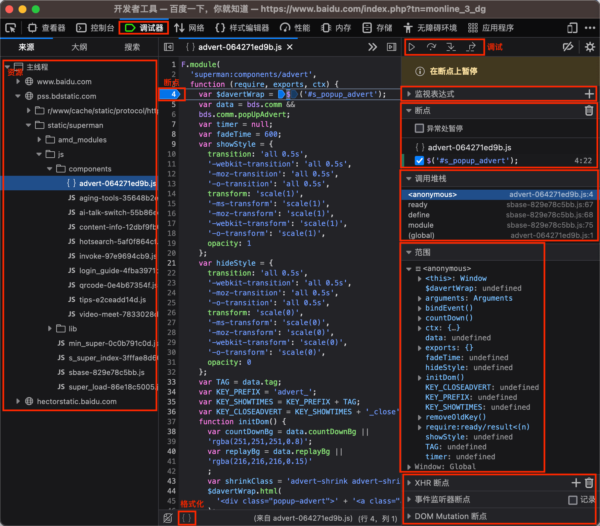

# 第五章 前端调试工具

---

<Badge type="tip" text="前端" />
<Badge type="tip" text="浏览器" />
<Badge type="tip" text="Chrome" />
<Badge type="tip" text="Firefox" />
<Badge type="tip" text="IE" />
<Badge type="tip" text="Safari" />
<Badge type="tip" text="浏览器调试" />
<Badge type="tip" text="移动端调试" />

## 概述

* 调试工具
  * **Google Chrome** ❤️
  * Mozilla Firefox
  * Apple Safari
  * Internet Explore
* 基本功能
  * 元素 Elements
    * html、css
  * 源码 Sources
    * 查看资源，html、css、js
    * 打断点调试、查看变量、堆栈
  * 网络 Network
    * 网络请求详细信息
  * 控制台 Console
    * 查看信息
    * 运行脚本
  * 应用 Application
    * 存储信息
  * 性能 Performance
    * 运行渲染过程
* 移动端调试

## Chrome {#chrome}

### 打开方式

* 更多(3个点) > `更多工具` > `开发者工具`
* 右击 > `检查`
* (`option` + `command`) / (`Ctrl` + `Shift`) + `I`
* `F12`

### 元素 Elements

* 编辑 html、css

### 源码 Sources

* 调试脚本
* 查看资源、变量、堆栈
* 调试资源

### 控制台 Console

* 查看信息
* 运行脚本

### 网络 Network

* 资源请求
* 请求信息
* 过滤排序

### 性能 Performance

* 记录网站生命周期

### 内存 Memory

* 追踪内存泄漏

### 应用 Application

* 存储

### 安全 Security

* 调试混合内容、证书问题

## Firefox

### 打开方式

* 工具(3条横) > `更多工具` > `开发者工具`
* 右击 > `检查`
* (`option` + `command`) / (`Ctrl` + `Shift`) + `I`
* `F12`

### 查看器

* 编辑 html、css

### 调试器

* 调试脚本
* 查看变量
* 查看调用堆栈

### 控制台

* 查看信息
* 运行脚本

### 网络

* 资源请求
* 请求信息
* 过滤排序

### 性能

### 内存

### 存储

### 样式编辑器

## IE

### 打开方式

* `设置` > `更多工具` > `F12 开发人员工具`
* 右击 > `检查元素`
* `F12`

### DOM 资源管理器

* 编辑 html、css

### 调试程序

* 调试脚本
* 查看变量
* 查看调用堆栈

### 控制台

* 查看信息
* 运行脚本

### 网络

* 资源请求
* 请求信息
* 过滤排序

### 仿真

* 文档模式(不同 IE 版本)
* 用户代理 userAgent
* 屏幕大小、显示
* 地理位置

### UI 响应

* UI 性能

### 探查器

* js 性能

### 内存

* 内存情况

## 移动端调试

### 调试方式

* 浏览器模拟
  * UA
  * 屏幕尺寸
* 真机调试
  * iOS Safari
  * Android Chrome

### Chrome 浏览器模拟

* [开发者工具](#chrome) > `切换设备`

### 真机调试

#### iOS Safari

* `Safari 浏览器` > `设置` > `高级` > `在菜单栏中显示"开发"菜单`

* `设置` > `Safari 浏览器` > `高级` > `JavaScript` `网页检查器`

* USB 连接设备进行调试，选择页面

* 💡 遇见 mac 系统版本、safari、iphone 系统版本太新、不匹配导致的无法调试问题，尝试[📎Safari Technology Preview](https://developer.apple.com/safari/technology-preview/)

#### Android Chrome

* 💣 需要科学上网
* `chrome://inspect/#devices` > `Discover USB devices`

* 打开手机开发者模式、USB 调试
  * 💣 **不同手机方式不同**

* USB 连接设备进行调试，选择页面 `inspect`

* 💡 使用[📎Edge](https://www.microsoft.com/zh-cn/edge) (Chromium 内核) 不需要科学上网 🎉
  * `edge://inspect/#devices`
