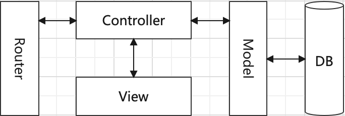

# 第一章 前端技术发展概述

---

<Badge type="tip" text="前端" />

## 前端技术发展演化过程

* **1990s html**（HyperText Markup Language，超文本标记语言）
  * 1989-1991 蒂姆·伯纳斯-李（Tim Berners-Lee）在欧洲核子研究中心（CERN）提出、发明了HTML、HTTP、URL
  * 1993 HTML 1.0（草案）
    * 互联网工程任务组（IETF）发布
    * 18-20个基本标签
* **1995 javascript**
  * 网景公司（Netscape）为了网页浏览器 Netscape Navigator 交互能力。雇佣布兰登·艾克（Brendan Eich）设计了 javascript
* **1996 css**（Cascading Style Sheets，层叠样式表）
  * CSS1 成为W3C推荐标准
  * Håkon Wium Lie（Haavard Wium Lie）是CSS的主要提出者
* **1990s 国内** 拨号上网，昂贵、不普及，只在教育行业、政府部门
* **1997 中国互联网起步**，网易成立
* **2000s** 宽带普及，互联网企业崛起 🚀
  * 门户
  * **静态网页**
  * **动态网页技术**
    * Web 服务器的技术 `JSP` `ASP` `PHP`，
    * 数据层、表示层代码混在一起
    * `MVC Template` 等技术进行代码分层，为后续前后端分离做准备
    * 
* **2005 AJAX/AJAJ/AFLAX** **flash**
  * Google、Yahoo
  * 异步数据通信、局部页面刷新
  * X 数据格式使用 XML(解析、传输开销大)，改用 JSON
  * 邮箱、地图
* **Web1.0 (HTML,PORTALS)**
  * 用户接收信息、网站管理员发布信息
  * 门户、新闻
* **Web2.0 (XML,RSS)**
  * 以用户为中心信息交换、互动
  * 网络社区、网络应用、博客、微博
* 网易产品
  * 2005 网易邮箱
  * 2006 网易博客
  * 2008 个人中心
  * 2010 网易微博
* **2007 国内前端工程师独立出来 🏆**
* WebApp SPA 单页系统架构
  * 
* 运行环境 浏览器
  * Internet Explorer 💔
  * Safari
  * Mozilla Firefox
  * Google Chrome ❤️
* **2009 NodeJS**
  * js 在服务器端运行的环境
  * Google V8引擎
  * 前端工程化
    * 脱离浏览器环境运行
    * 对系统层面API
  * 后端能力
* 2010 网易博客 Android、iOS 版
* 2012 网易云音乐、有道协作
* **2014 HTML5、CSS3**
* **2015 ECMAScript6**
  * Modules、Enhanced Object Literals、Block Scoping、Promises、Classes、Arrows

## 移动互联网的发展演化过程

* **2001 移动梦网**
* **2007 iOS、Android**
* **2009 3G**
* **2013 4G**

## 各个阶段关注的技术点

* 平台兼容
  * Prototype、jQuery、MooTools、Dojo、modernizr...
* UI 组件化
  * Bindows、YUI、jQueryUI、Ext、Bootstrap、SemanticUI...
* 分层模块化(MVC、MVVM)
  * JavascriptMVC、Backbone、Knockout、Vue、EmberJS、Angular、React...
* 标准化、工具化、自动化、智能化
* 前后端分离
  * 专注
  * SPA
  * 代理转发
  * 中间层
  * 模拟容器
* 包依赖管理
  * bower、npm、yarn、pnpm
* 代码预处理
  * less、sass、stylus
* 工程构建发布
  * grunt、gulp、browserify、webpack
* 持续集成
* 移动端应用、低成本多端适配解决方案
  * Hybrid App
    * NativeApp 嵌套 WebView 通过 JSBridge 与原生交互
    * NativeApp 嵌套 Lua 环境 通过适配层 Adapter 调用原生
    * DSL 编译成 Android、iOS 代码
    * PhoneGap、Xamarin、titanium appcelerator、React Native、Ionic、Onsen UI
