# 第四章 前端开发工具

---

<Badge type="tip" text="前端" />
<Badge type="tip" text="IDE" />
<Badge type="tip" text="WebStorm" />
<Badge type="tip" text="Sublime Text" />
<Badge type="tip" text="VSCode" />

## 概述

* 记事本
* 开发工具
  * 辅助开发
  * 更有效率
  * WebStorm
  * VSCode
  * HBuilder
  * IntelliJ IDEA
  * Atom
  * Vi/Vim
  * Notepad++
  * Eclipse
* 功能
  * 主题风格
    * 字体
    * 字号
  * 快捷操作
    * 搜索文件
    * 移动、删除、新增
  * 插件
  * 语法高亮
  * 语法检查
  * 智能提示
  * 版本管理

## [📎 WebStorm](https://www.jetbrains.com.cn/webstorm/)

### 主界面

* 需要打开设置的 `Appearance & Behavior` > `New UI` > `Enable New UI`

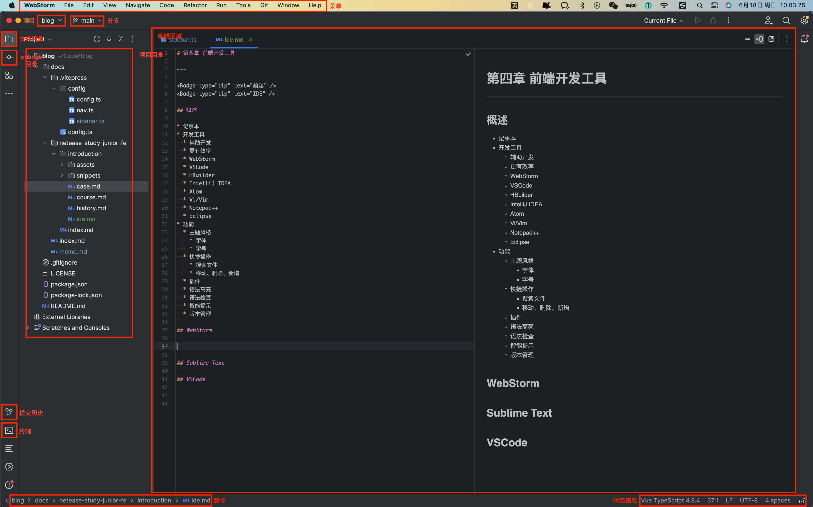

### 设置

* `Webstorm` > `Preferences...`
* `Webstorm` > `Settings...`
* `File` > `Settings...`
* `command` + `,`
* `Ctrl` + `Alt` + `S` 

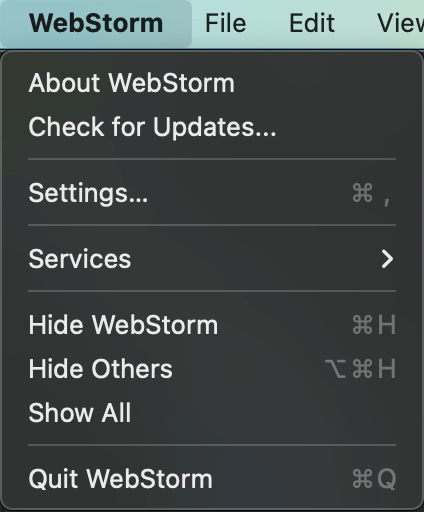
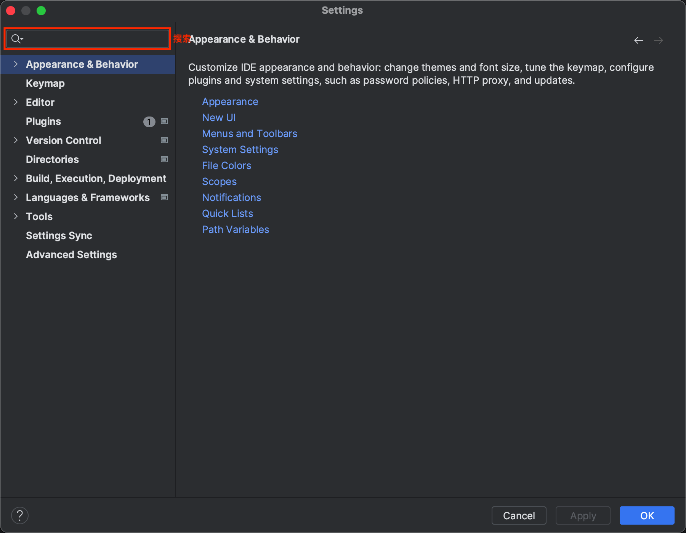

#### 主题

* `Settings...` > `Appearance & Behavior` > `Appearance` > `Theme`

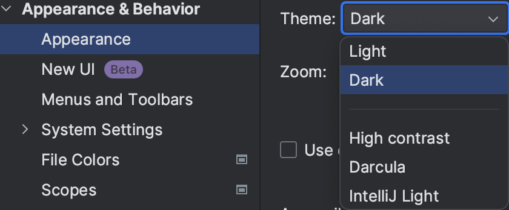

#### 字体、大小

* `Settings...` > `Editor` > `Font`

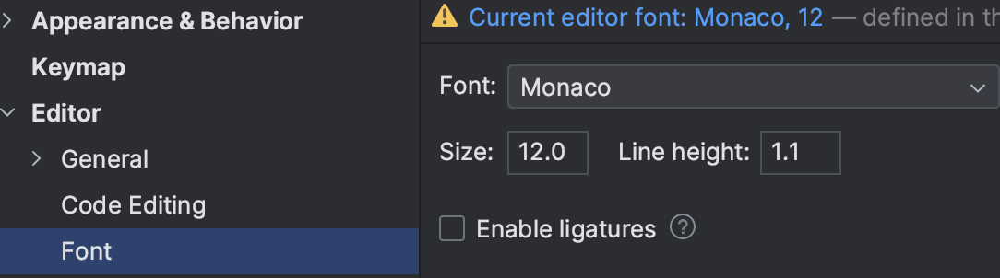

#### 快捷键

* `Settings...` > `Keymap`

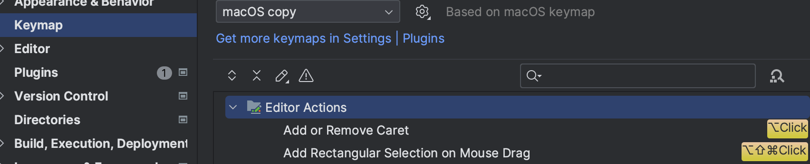

#### 插件

* `Settings...` > `Plugins`

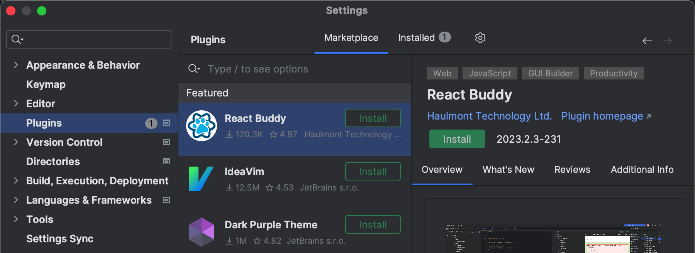

### 快捷操作

* 查找文件 `Shfit` + `Shift`
* 查找定义、引用 `command` / `Ctrl` + 鼠标指向对应代码
* 新起一行 `Shift` + `Enter`
* 列操作 `shift` + `option` / `Alt` + 鼠标拖动
  * `Esc` 退出列操作
* 注释 `command` / `Ctrl` + `/`
* 多行注释 `control` / `Ctrl` + `Shift` + `/`
* 格式化代码 (`option` + `command`) / (`Ctrl` + `Alt`) + `L`
* 新建文件、目录 `command` / `Ctrl` + `N`
* 键盘移动、选择 (`↑` / `↓` / `←` / `→`) + (`option` / `Ctrl` / `command`) + `Shift`
* 复制一行 `command` / `Ctrl` + `D`
* 删除一行 `command` / `Ctrl` + `X`
* Emmet 语法 `Tab`
* 移动代码 `command` / `Alt` + `Shift` + `↑` / `↓`

### 语法高亮

### 语法检查

### 智能提示

#### Live Templates

* `Settings...` > `Editor` > `Plugins`

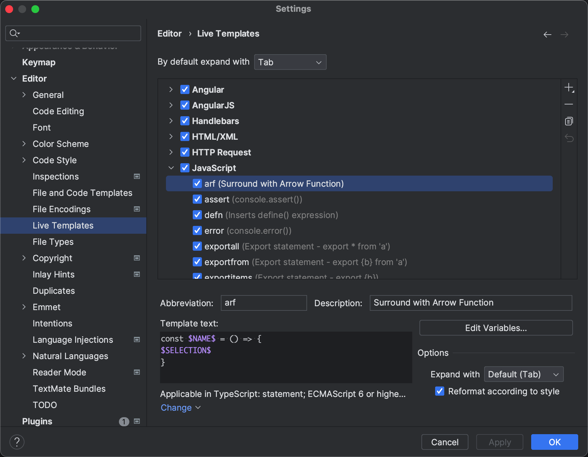

### 版本管理 ⭐

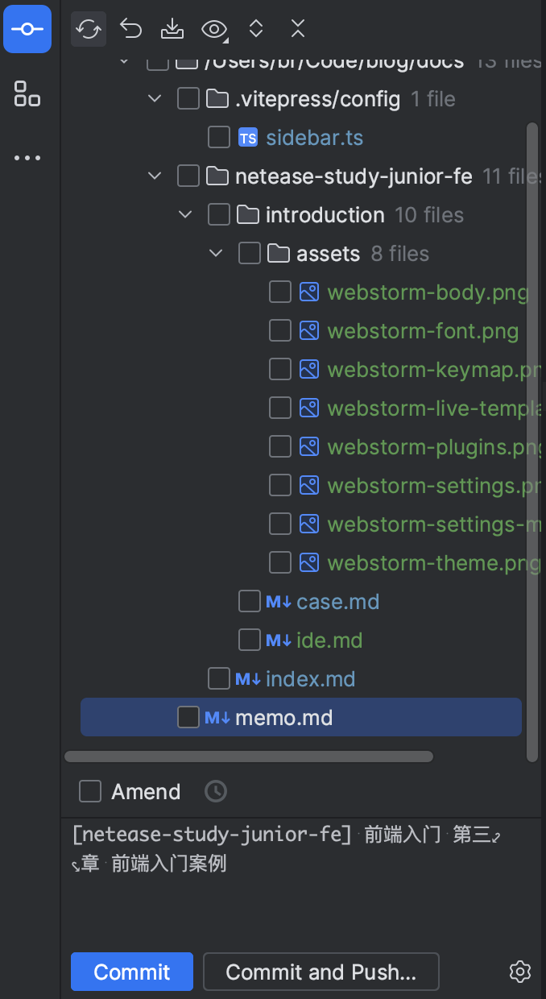
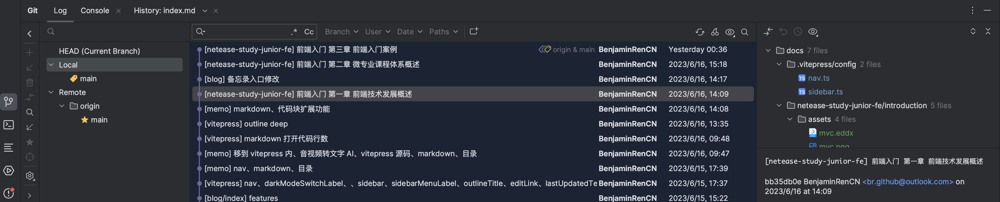

### 其他功能

* 调试 Node.js
* 部署项目
* 代码重构

## [📎 Sublime Text](http://www.sublimetext.com/)

### 主界面

### 设置文件 {#sublime-setting}

* `Sublime Text` > `Settings...` > `Settings`
* `command` + `,`

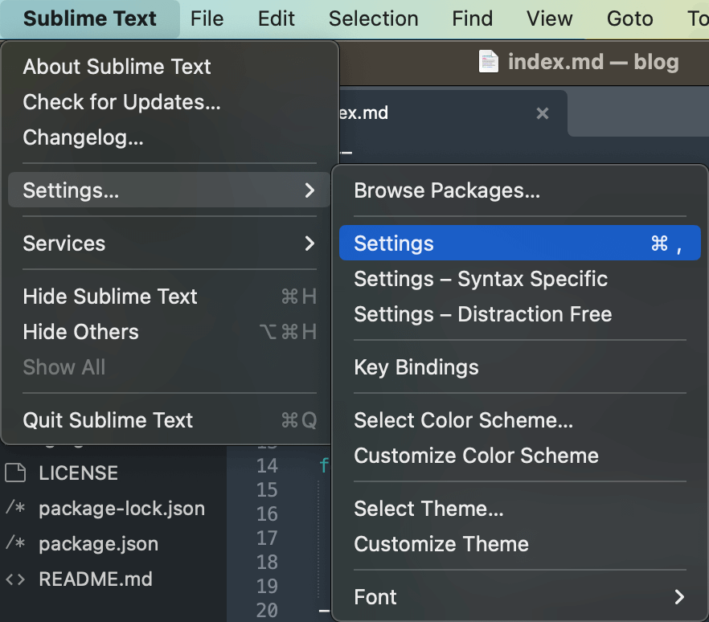
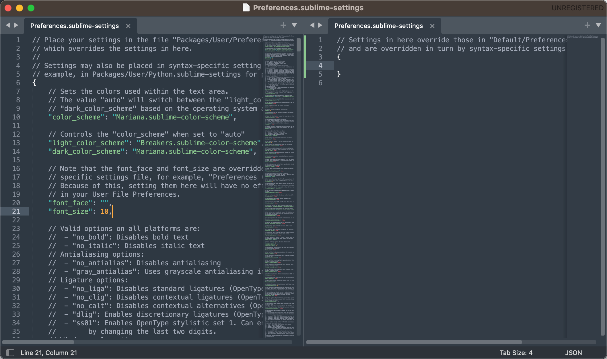

#### 主题

* `Sublime Text` > `Settings...` > `Select Color Scheme`

#### 字体大小

* [`设置文件`](#sublime-setting) > `"font_size"`

#### 快捷键

* `Sublime Text` > `Settings...` > `Key Bindings`

### 快捷操作

* 新建文件 `command` + `N`
* 查找文件 `command` + `P`
* 查找定义、引用 鼠标移动上去会有 `Definition of` `References of`
* 查找所有定义 `command` + `shift` + `R`
* 移动、选择 (`↑` / `↓` / `←` / `→`) + (`option` / `command`) + `shift`
* 选中一样的内容 `command` + `D`
* 多行多列操作 `command` + 点击
* 新起一行 `command` + `enter`
  * 向上新起一行 `command` + `shift` + `enter`
* 注释 `command` + `/`
* 多行注释 `option` + `command` + `/`
* 删除 `command` + `X`

### 命令面板 {#sublime-command}

* `command` + `shift` + `P`

### 控制台

* `View` > `Show Console`
* `command` + <code>`</code>

### 插件

* 安装 Package Control [命令面板](#sublime-command) + `Install Package Control`
* 点击安装插件 [命令面板](#sublime-command) + `Package Control: Install Package`
* 输入搜索插件

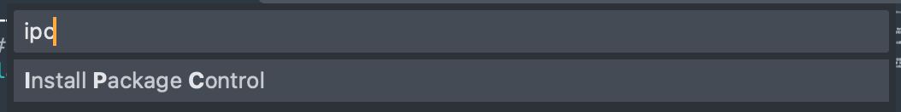
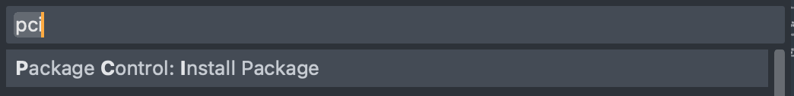
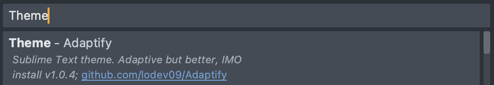

* 插件网址 https://packagecontrol.io/
* 常用插件
  * Emmet
  * DocBlockr 注释
  * SideBarEnhancements 加强侧边栏功能
  * Alignment 格式化时候对齐代码
  * Git

### 语法高亮

### 语法检查

* 要安装插件
* SublimeLinter
  * [📎 SublimeLinter-contrib-htmlhint](https://packagecontrol.io/packages/SublimeLinter-contrib-htmlhin)
  * [📎 SublimeLinter-jshint](https://packagecontrol.io/packages/SublimeLinter-jshint)
  * [📎 SublimeLinter-csslint](https://packagecontrol.io/packages/SublimeLinter-csslint)

### 智能提示

* 内置
* 当前文件
* snippets
  * `Tools` > `Developer` > `New Snippet...`

### 版本管理

* git

## [📎 VSCode](https://code.visualstudio.com/)

### 主界面

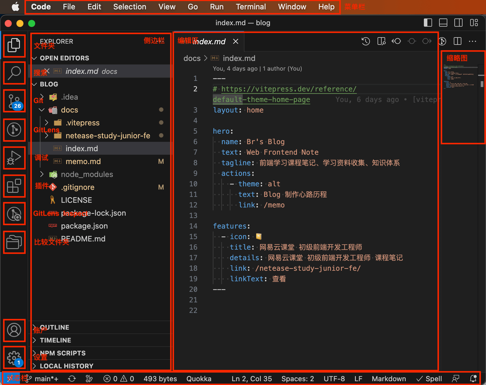

### 设置

* `Manage`

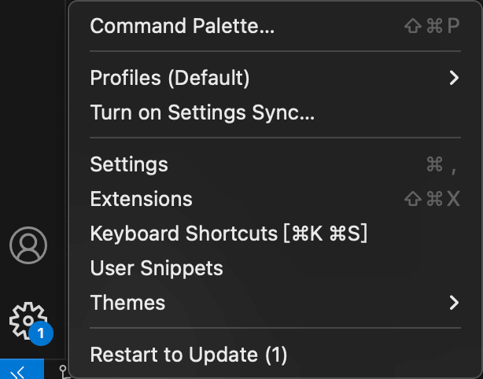

#### 设置文件 {#vscode-setting}

* `Manage` + `Settings`
* `command` + `,`

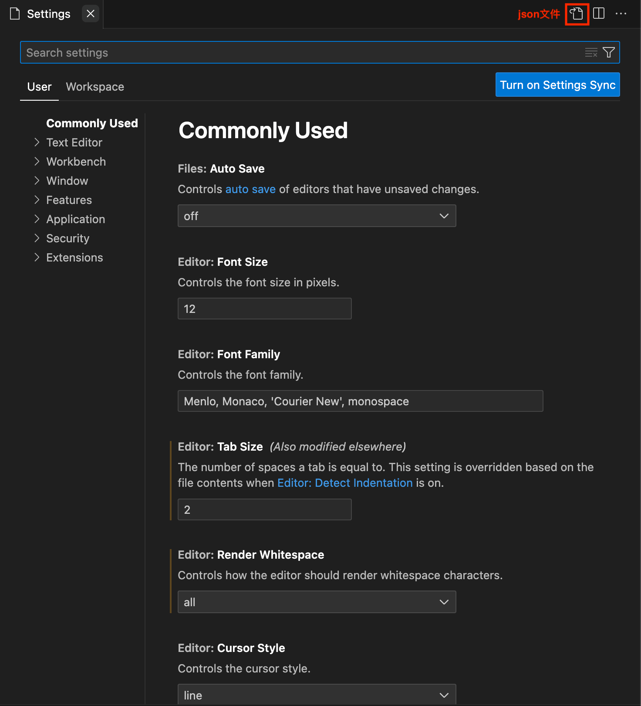
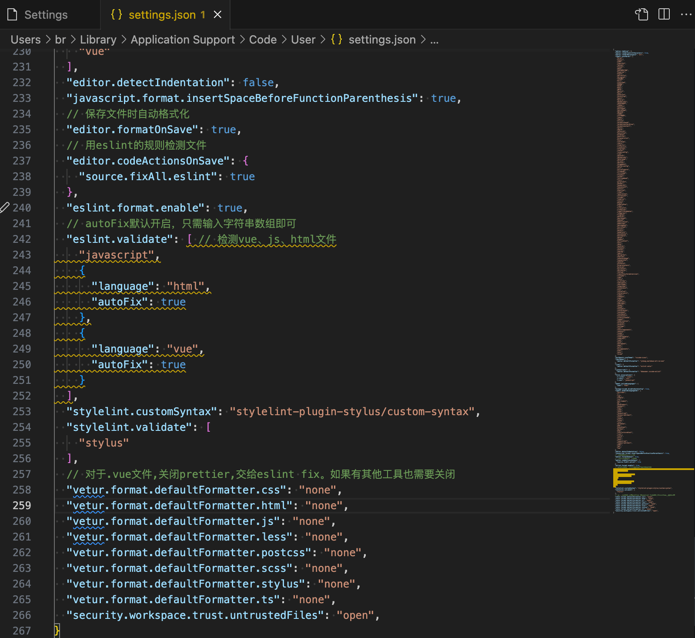

#### 主题

* `Manage` > `Theme` > `Color Theme`
* (`command` + `K`) + (`command` + `T`)

#### 字体、大小

* [`设置文件`](#vscode-setting) > `Text Editor` > `Font` > `Font Family` / `Font Size`
* [`设置文件`](#vscode-setting) > `"editor.fontFamily"` / `"editor.fontSize"`

#### 快捷键

* `Manage` > `Keyboard Shortcuts`
* (`command` + `K`) + (`command` + `S`)

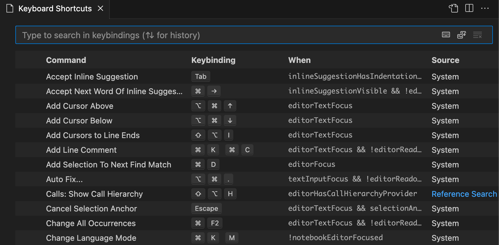

### 插件

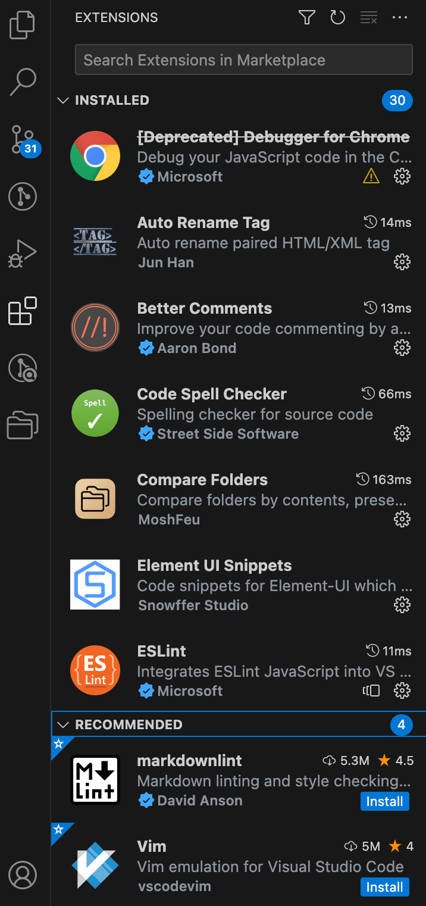

### 快捷操作

* 查找文件 `command` + `P`
* 查找定义 鼠标指向对应代码 + `command` / `F12`
* 移动、选择 (`↑` / `↓` / `←` / `→`) + (`option` / `command`) + `shift`
* 复制一行 `option` + `shift` + `↑` / `↓`
* 删除 
  * `command` + `X`
  * `command` + `shift` + `K`
* 选中一样的内容 `command` + `D` 
* 多列操作 `option` + `shift` + 鼠标拖动
* 注释 `command` + `/`
* 多行注释 `option` + `shift` + `A`
* 格式化代码 `option` + `shift` + `F`

### 命令面板

* `command` + `shift` + `P`

### 语法高亮

### 语法检查

* ESLint
* stylelint

### 智能提示

* 内置
* 当前文件
* snippets
  * `Manage` > `User Snippets`

### 版本管理

### 其他功能

* 调试 Node.js
